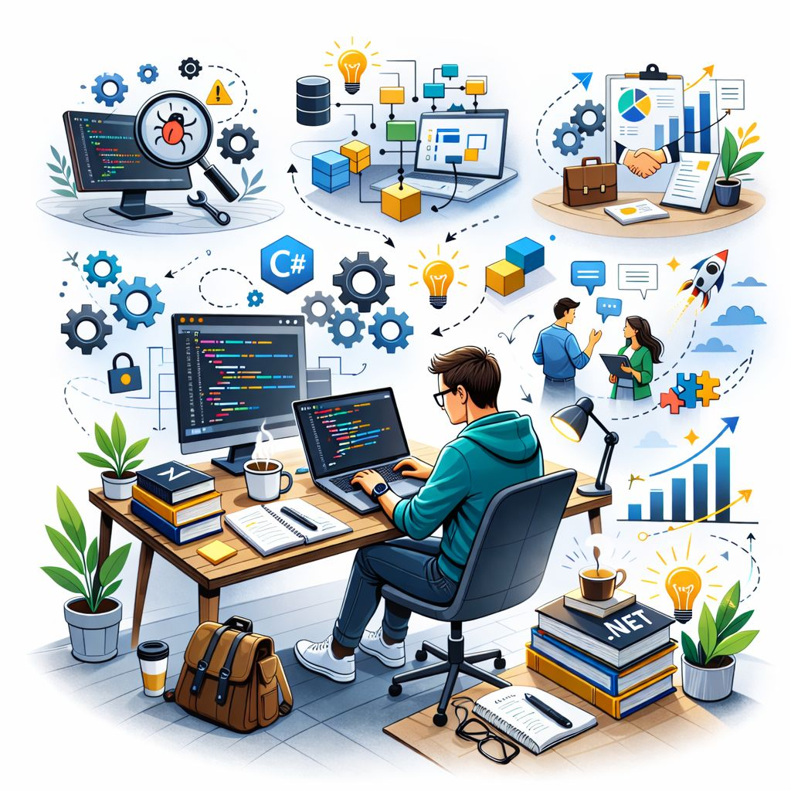

## 🚀 Core Expertise
 
- Full Stack Web Development (.NET & JavaScript Frameworks)
- RESTful API Development (ASP.NET Core Web API)
- Clean Architecture & Scalable Application Design
- Frontend Development with Modern JS Frameworks
- Database-driven Enterprise Applications
 
---
 
## 🛠 Technologies & Tools
 
### 🧩 Backend Development

 
---

### 🗄 Database & Reporting

 
---
 
### 🌐 Frontend Development

---

### ⚙ DevOps & Tools

---

## 🏢 Domain Experience

### 👥 HR & Payroll Systems  
- 🧾 Employee Information Management  
- ⏱ Attendance & Leave Management  
- 💰 Payroll Processing (Salary, Allowance, Deduction)  
- 📊 HR & Payroll Reports  
- 🔐 Secure & Role-based Data Handling  

---

### 📦 Inventory Management Systems  
- 🏷 Item, Category & Sub-Category Management  
- 📥 Stock In / 📤 Stock Out Tracking  
- 🛒 Requisition & Purchase Workflow  
- 🏪 Warehouse & Store Management  
- 📈 Real-time Stock & Valuation Reports  

---

### 🧩 ERP Business Modules  
- 🏗 Modular ERP Design & Development  
- 🔗 Cross-Module Integration (HR, Inventory, Finance)  
- ⚙ Business Process Automation  
- 🧑‍💼 Role-based Access Control  
- 📑 Management Reporting & Dashboards  

